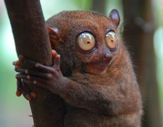

# Пример 1
Tут какие-то слова...  
слова...  
Вот `цитата` например!  
>Еще слова  

и код c++
```c++
#include "main.h"
using namespace std;
int main(int argc, char* argv[])
{
    string input_str(argv[1]);
    cout << input_str << std::endl;
    return 0;
} 
```
## И заголовок 2 ##
 с картинкой  

